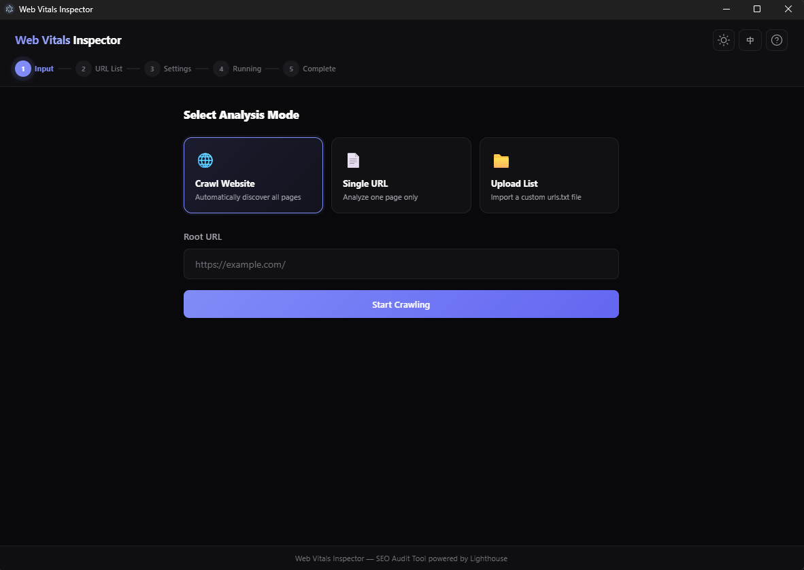
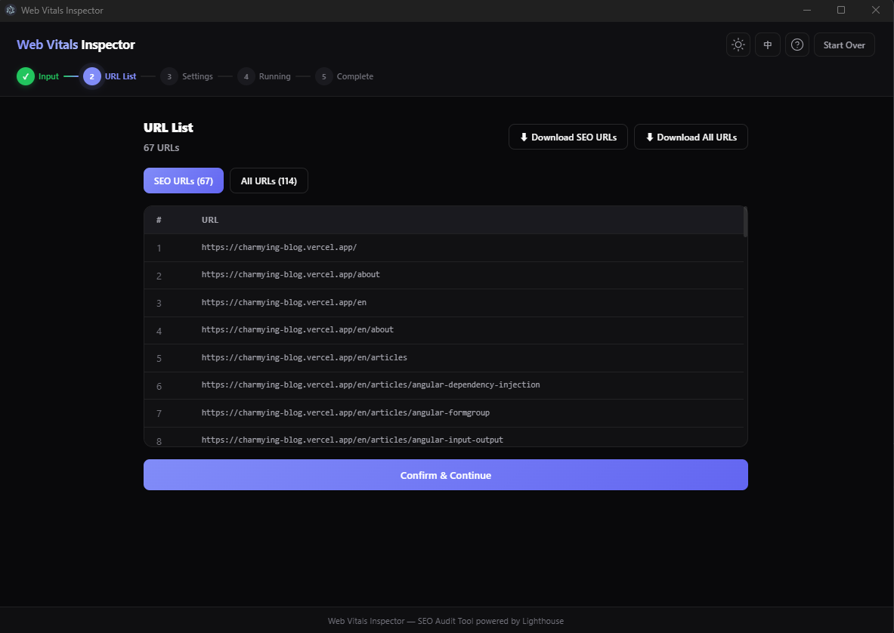
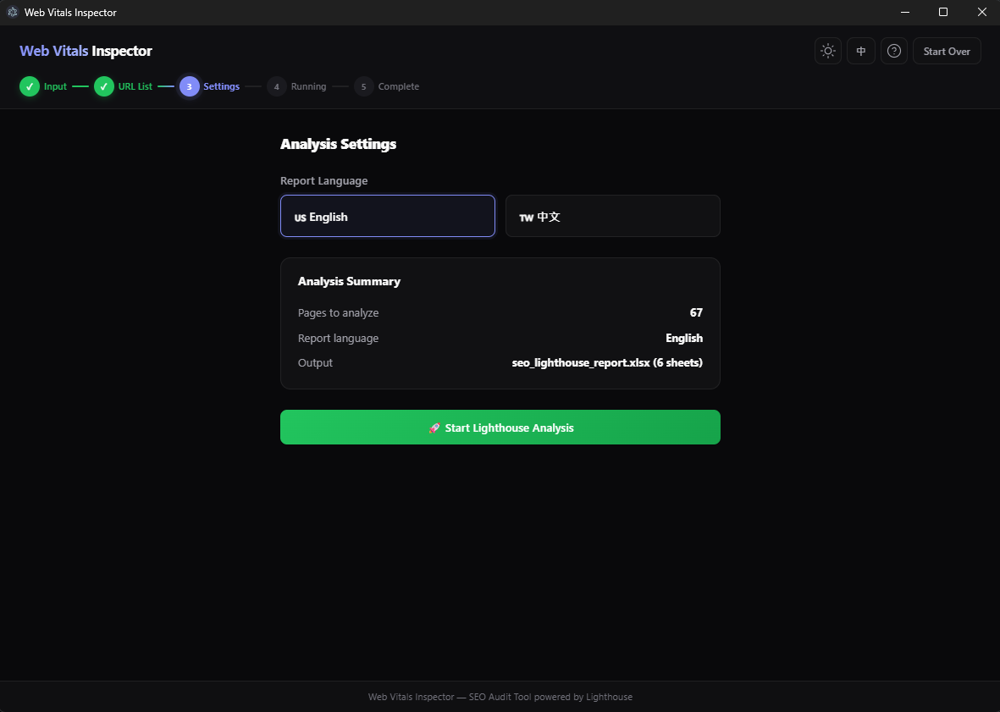
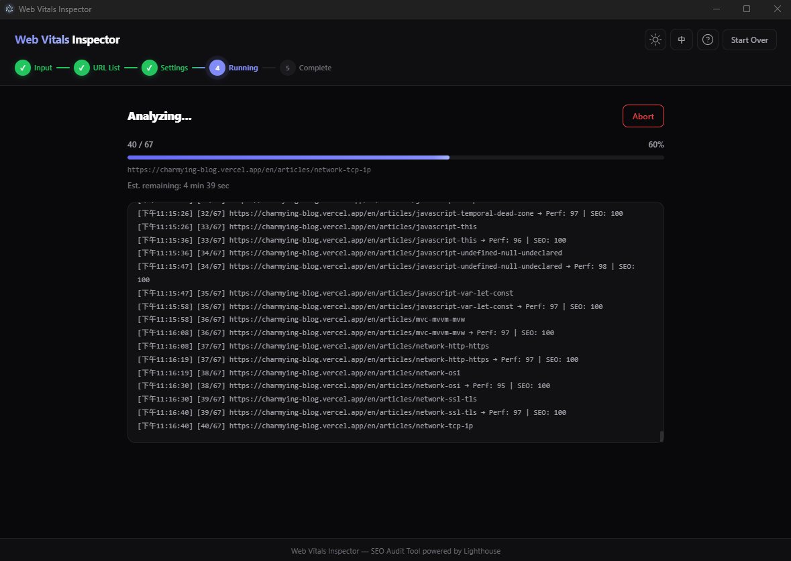
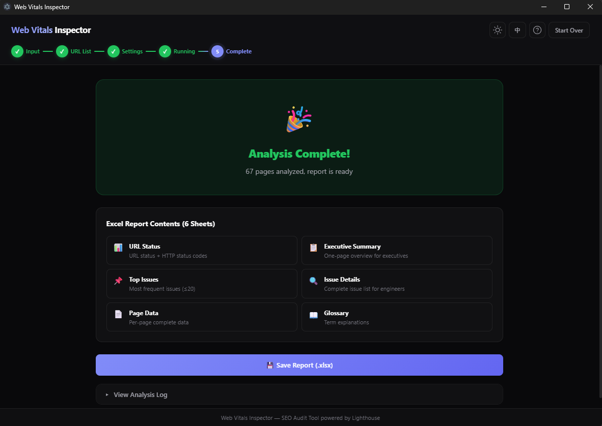

# Page Function Description

**English** | [繁體中文](./page-function-description.zh-TW.md)

This document provides a brief introduction to the functionality of each page.

---

## Step 1 - Input

Choose to crawl an entire website, a single URL, or import a custom `.txt` file containing your URLs.

    
     
    The default setting is to crawl the entire website.

---

## Step 2 - URL List

Generates a list of the target URLs.

    
     
    From the top right corner, you can download either the URLs specifically flagged for SEO issues, or export the complete URL list.

---

## Step 3 - Settings

Configure the settings for your analysis.

    
     
    You can choose to export the final Excel report in either English or Chinese.

---

## Step 4 - Running

Starts the performance auditing and analysis.

    
     
    Waiting for the audit and analysis to finish.

---

## Step 5 - Complete

Analysis complete.

    
     
    You can now download the generated Excel report.

