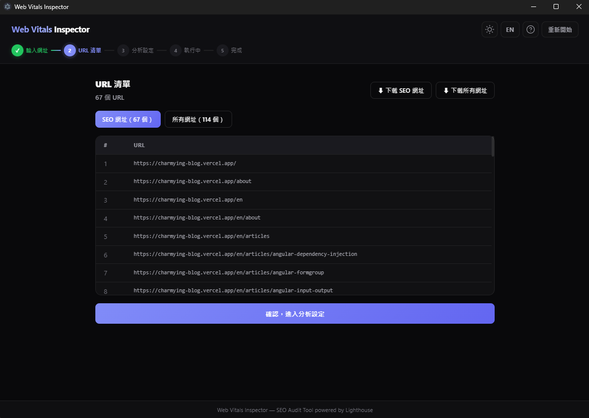
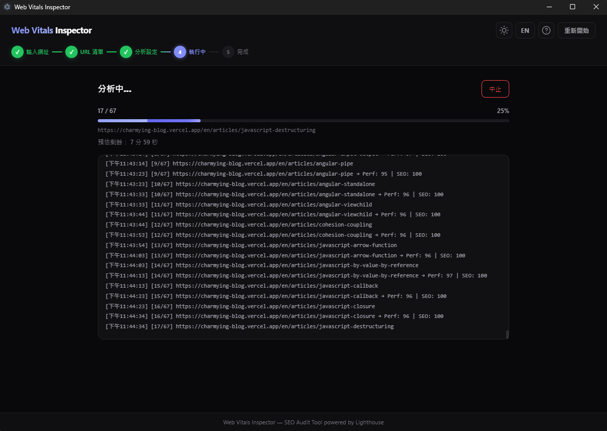

# 頁面功能說明

[English](./page-function-description.md) | **繁體中文**

本文件簡單介紹各頁面功能

---

## 第 1 步 - 輸入網址

可以選擇爬取整個網站或單一網址或自訂的網址 txt 檔。

    
     
    畫面預設為爬取整個網站。

---

## 第 2 步 - URL 清單

產生 URL 清單。

    
     
    右上角可以下載預設判斷影響 SEO 的網址檔案或全部網址檔案。

---

## 第 3 步 - 分析設定

進行分析的相關設定。

    
     
    可以選擇最後產生的 Excel 檔為中文或英文。

---

## 第 4 步 - 執行中

開始進行跑分與分析。

    
     
    等待跑分與分析。

---

## 第 5 步 - 完成

分析結束。

    
     
    可以下載分析出的 Excel 報告。

